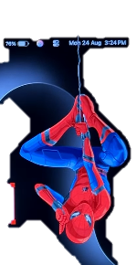

# 🕷 Spidey Reminder (v1.1.0)

[](https://github.com/rakeshkumar0804/spidey-reminder/releases/tag/v1.1.0)
[](https://github.com/rakeshkumar0804/spidey-reminder/releases/download/v1.1.0/SpideyReminder.exe)
[](https://github.com/rakeshkumar0804/spidey-reminder)

A lightweight, custom-first Windows desktop reminder companion that brings Spider-Man to your screen when tasks are due!



---

## 📦 Features & Highlights

- **Custom-Reminder-First Design**:
  - Fresh installations start with **zero active reminders** for a clean slate.
  - Create one-time reminders for specific dates/times or recurring schedules (every N minutes or hours).
  - Quick-start templates for **Eye Break** (20-20-20 rule) and **Hydration** (water breaks).
- **Spider-Man Entrance Animation**:
  - Spider-Man shoots down a thin twisted web strand from the top edge of your monitor.
  - Visibly descends, hangs upside down, and settles near the top right of your active display.
  - Plays a movie-like entrance animation sequence or respects reduced-motion preferences.
- **Card UI & Controls**:
  - Displays reminder title, custom message, and header tags (`■ CUSTOM REMINDER`, `■ EYE BREAK`, `■ HYDRATION`, `■ OVERDUE REMINDER`).
  - **Snooze 5m**: Postpones the reminder by 5 minutes without missing future recurring occurrences.
  - **Done**: Completes the current break.
- **Automatic 20-Second Dismissal**:
  - Every break counts down for 20 seconds.
  - Automatically dismisses and retracts Spider-Man cleanly back up off-screen if left unattended.
- **Legacy Migration Support**:
  - Users upgrading from older versions get a one-time prompt to keep or disable previous automatic Eye/Water break schedules.
- **Windows Focus Protection**:
  - Built with Win32 `WS_EX_NOACTIVATE` and `WS_EX_TOPMOST` window flags so typing and gaming focus are never interrupted.
- **System Tray Integration**:
  - Runs quietly in the system notification area.
  - Right-click tray menu for **Reminder Manager**, **Test Animation**, **Pause/Resume**, and **Quit**.
- **100% Private & Offline**:
  - All reminders and settings are stored locally in `%APPDATA%\SpiderBreakCompanion\settings.json`.

---

## 🚀 Quick Start / Direct Download

### Standalone Executable (Recommended for End Users)
Download the pre-compiled portable `.exe` (no Python installation required):
👉 **[Download SpideyReminder.exe (v1.1.0)](https://github.com/rakeshkumar0804/spidey-reminder/releases/download/v1.1.0/SpideyReminder.exe)**

Simply double-click `SpideyReminder.exe`. It will place an icon in your system tray and open the Reminder Manager on first launch.

---

## 🛠 Building & Running from Source

### Prerequisites
- Python 3.10+
- Windows 10 or 11

### Installation & Launch
1. Clone the repository:
   ```powershell
   git clone https://github.com/rakeshkumar0804/spidey-reminder.git
   cd spidey-reminder
   ```
2. Install Python dependencies:
   ```powershell
   pip install PyQt5 Pillow pywin32
   ```
3. Run the application:
   ```powershell
   python companion.py
   ```

### Packaging into a Standalone Executable
To package the app into a single-file executable (`dist/SpideyReminder.exe`) using PyInstaller:
```powershell
python -m PyInstaller --noconfirm --clean --onefile --windowed --name SpideyReminder --icon tray_icon.png --add-data "spiderman_hanging.png:." --add-data "tray_icon.png:." companion.py
```

---

## 🌐 Product Website

The project includes a standalone product showcase website located in the `website/` directory, built with **React**, **Vite**, **Tailwind CSS**, and **Lucide Icons**.

To run the website locally:
```bash
cd website
npm install
npm run dev
```
To build the website for production:
```bash
npm run build
```

---

## 📁 Repository Structure

```text
spidey-reminder/
├── companion.py           # Main application entry point & system tray management
├── overlay.py             # Spider-Man 6-stage overlay animation window & card UI
├── reminder_engine.py     # Scheduling, snooze, queueing, & persistent timers
├── settings_dialog.py     # PyQt Reminder Manager dialog for creating/editing tasks
├── config.py              # Settings persistence (%APPDATA%\SpiderBreakCompanion)
├── tray.py                # System tray icon & context menu handlers
├── spiderman_hanging.png  # Character artwork asset (cutout)
├── tray_icon.png          # System tray icon asset
├── website/               # Product download website (React + Vite + Tailwind)
└── README.md              # Documentation
```

---

## 📄 License
Distributed under the MIT License.
