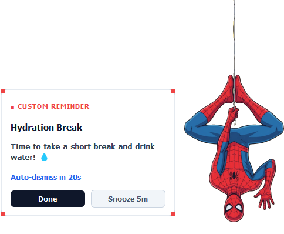

# Spidey Reminder

[](https://github.com/rakeshkumar0804/spidey-reminder/releases/tag/v1.1.0)
[](https://github.com/rakeshkumar0804/spidey-reminder)
[](https://www.python.org/)

A Windows desktop companion for custom reminders, delivered by an animated Spider-Man overlay.

[Website](https://spidey-reminder.vercel.app) • [Download v1.1.0 EXE](https://github.com/rakeshkumar0804/spidey-reminder/releases/download/v1.1.0/SpideyReminder.exe) • [Releases Page](https://github.com/rakeshkumar0804/spidey-reminder/releases)

---

## Product Preview



*Preview rendered from the desktop overlay component.*

---

## Features

- **Custom Reminders**: Create one-time reminders for specific dates and times, or set repeating schedules in minutes or hours.
- **Clean Initial Setup**: Fresh installations start with zero active reminders, leaving full control to the user.
- **Optional Templates**: Quick pre-fill options for Eye Break (20-20-20 rule) and Hydration reminders.
- **Animated Desktop Overlay**: Spider-Man descends from the top of your monitor to display your reminder card.
- **Flexible Dismissal**: Respond with **Done**, postpone by 5 minutes with **Snooze 5m**, or let the 20-second timer auto-dismiss.
- **System Tray & Preferences**: Runs quietly in the notification area with local offline persistence, startup options, and reduced-motion preferences.

---

## Download & Quick Start

### Standalone Executable (For End Users)

- **Supported OS**: Windows 10 / 11 (64-bit).
- **Download Link**: [SpideyReminder.exe (v1.1.0)](https://github.com/rakeshkumar0804/spidey-reminder/releases/download/v1.1.0/SpideyReminder.exe)

1. Download `SpideyReminder.exe` and open it. No Python installation or setup is required.
2. The **Reminder Manager** window automatically opens on first launch.
3. Add a custom reminder or choose an optional template, then click **Save Reminder**.
4. Access controls anytime by right-clicking the spider icon in your Windows system tray.

---

## Local Development

### Desktop Application Setup

Running the Python application from source requires **Python 3.10+** on Windows 10 or 11.

Clone the repository, then enter its directory:

```powershell
# 1. Clone the repository
git clone https://github.com/rakeshkumar0804/spidey-reminder.git
cd spidey-reminder

# 2. Install required Python packages
python -m pip install PyQt5 Pillow pywin32

# 3. Launch the desktop application
python companion.py
```

### Product Website Setup

The standalone showcase website is located in the `website/` directory and built using React, Vite, and Tailwind CSS. Requires **Node.js 18+**.

From the repository root, run:

```powershell
# 1. Navigate to the website directory
cd website

# 2. Install Node dependencies
npm install

# 3. Start local development server
npm run dev

# 4. Build website for production
npm run build
```

---

## Building the Windows Executable

To package the Python desktop application into a single-file portable executable (`dist/SpideyReminder.exe`), install PyInstaller and run the packaging command.

From the repository root, run:

```powershell
# 1. Install PyInstaller
python -m pip install pyinstaller

# 2. Package into a single-file executable
python -m PyInstaller `
  --noconfirm `
  --clean `
  --onefile `
  --windowed `
  --name SpideyReminder `
  --icon tray_icon.png `
  --add-data "spiderman_hanging.png;." `
  --add-data "tray_icon.png;." `
  companion.py
```

The output binary will be generated at `dist/SpideyReminder.exe`.

---

## Project Structure

| Path | Purpose |
| :--- | :--- |
| `companion.py` | Main application entry point, single-instance mutex, and app lifecycle manager |
| `overlay.py` | Transparent PyQt overlay window, Spider-Man animation sequence, and card UI |
| `reminder_engine.py` | Core scheduling logic, background timers, snooze handling, and reminder queues |
| `settings_dialog.py` | Reminder Manager GUI dialog for creating, editing, and toggling schedules |
| `config.py` | Settings loader and local JSON storage manager |
| `tray.py` | System tray icon, context menu handlers, and notification integration |
| `spiderman_hanging.png` | Character cutout artwork used by the desktop overlay |
| `tray_icon.png` | Application icon asset for system tray and window headers |
| `website/` | Standalone product website source code (React, Vite, Tailwind CSS) |

---

## Settings & Known Limitations

- **Local Storage Path**: Reminders and app settings are stored locally on your machine at `%APPDATA%\SpiderBreakCompanion\settings.json`.
- **Known Visual Issue**: Reminder text may appear all at once instead of word by word on some Windows setups.
- **Browser Demo Note**: The product website preview runs entirely in the browser and does not schedule desktop reminders.

---

## Feedback & License

- **Issue Tracker**: Report bugs or feature requests on [GitHub Issues](https://github.com/rakeshkumar0804/spidey-reminder/issues).
- **License Status**: No `LICENSE` file is currently included in this repository. Spider-Man character artwork and character rights remain the property of their respective copyright holders.
